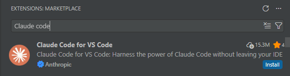

[English](./claude_code.md) | [简体中文](./claude_code.zh-CN.md) · [← 返回](../README.zh-CN.md)

# 接入 Claude Code

Claude Code 是 Anthropic 推出的终端级 AI 编程助手，同时支持 VS Code 扩展。MiMo 仅通过 Anthropic 兼容协议接入 Claude Code。

## 前置条件

Claude Code 支持**按量付费 API** 和 **Token Plan** 两种使用方式，配置前需先获取对应凭证。

| 使用方式 | 说明 | 获取凭证 |
|---|---|---|
| **按量付费** | 按实际使用量计费，适合轻度使用 | 前往 [API Keys](https://platform.xiaomimimo.com/console/api-keys) 创建 API Key |
| **Token Plan** | 固定订阅，按套餐限量调用 | 订阅成功后，前往 [订阅管理](https://platform.xiaomimimo.com/console/plan-manage) 获取专属 Base URL 和 API Key |

## 1. 安装 Claude Code CLI

### 方式一：原生安装（推荐）

原生安装会自动在后台更新，保持最新版本。

macOS / Linux / WSL：

```shell
curl -fsSL https://claude.ai/install.sh | bash
```

Windows PowerShell：

```powershell
irm https://claude.ai/install.ps1 | iex
```

Windows CMD：

```batch
curl -fsSL https://claude.ai/install.cmd -o install.cmd && install.cmd && del install.cmd
```

> 在原生 Windows 上建议安装 [Git for Windows](https://git-scm.com/download/win)，以便 Claude Code 使用 Bash 工具。

### 方式二：npm

- 需要 [Node.js](https://nodejs.org/en/download/) 18+。
- Windows 用户需安装 [Git for Windows](https://git-scm.com/download/win)。

```shell
npm install -g @anthropic-ai/claude-code
```

---

验证安装：

```shell
claude --version
```

更多安装方式（Homebrew、WinGet 等）请参阅[官方安装指南](https://code.claude.com/docs/zh-CN/setup)。

## 2. 配置 Claude Code

### 跳过登录提示

创建或编辑 `~/.claude.json`（Windows：`C:\Users\<用户名>\.claude.json`）以跳过 Anthropic 登录界面：

```json
{
  "hasCompletedOnboarding": true
}
```

### 配置 API 凭证

Claude Code 可通过配置文件或环境变量进行配置。大多数情况下建议使用配置文件，因为 Claude Code CLI 和 VS Code 扩展均可读取配置文件中的设置。

配置文件位置：
- Linux / Mac：`~/.claude/settings.json`
- Windows：`C:\Users\<用户名>\.claude\settings.json`
- **如果文件不存在，请手动创建。**

#### 支持的模型

Claude Code 仅支持文本生成模型。完整模型列表请参阅 [模型列表](https://platform.xiaomimimo.com/docs/zh-CN/quick-start/model)。

#### 按量付费

前往 [API Keys](https://platform.xiaomimimo.com/console/api-keys) 创建 API Key（格式：`sk-xxxxx`）。

```json
{
  "env": {
    "ANTHROPIC_BASE_URL": "https://api.xiaomimimo.com/anthropic",
    "ANTHROPIC_AUTH_TOKEN": "MIMO_API_KEY",
    "ANTHROPIC_MODEL": "mimo-v2.5-pro[1m]",
    "ANTHROPIC_DEFAULT_OPUS_MODEL": "mimo-v2.5-pro[1m]",
    "ANTHROPIC_DEFAULT_SONNET_MODEL": "mimo-v2.5-pro[1m]",
    "ANTHROPIC_DEFAULT_HAIKU_MODEL": "mimo-v2.5-pro[1m]",
    "CLAUDE_CODE_DISABLE_NONESSENTIAL_TRAFFIC": "1"
  }
}
```

#### Token Plan

订阅成功后，前往 [订阅管理](https://platform.xiaomimimo.com/console/plan-manage) 获取专属 Base URL 和 API Key（格式：`tp-xxxxx`）。

> 将 `{region}` 替换为 [订阅管理](https://platform.xiaomimimo.com/console/plan-manage) 页面中显示的集群标识（`cn` 中国集群、`sgp` 新加坡集群、`ams` 欧洲集群）。

```json
{
  "env": {
    "ANTHROPIC_BASE_URL": "https://token-plan-{region}.xiaomimimo.com/anthropic",
    "ANTHROPIC_AUTH_TOKEN": "MIMO_API_KEY",
    "ANTHROPIC_MODEL": "mimo-v2.5-pro[1m]",
    "ANTHROPIC_DEFAULT_OPUS_MODEL": "mimo-v2.5-pro[1m]",
    "ANTHROPIC_DEFAULT_SONNET_MODEL": "mimo-v2.5-pro[1m]",
    "ANTHROPIC_DEFAULT_HAIKU_MODEL": "mimo-v2.5-pro[1m]",
    "CLAUDE_CODE_DISABLE_NONESSENTIAL_TRAFFIC": "1"
  }
}
```

#### 说明

- 将 `ANTHROPIC_AUTH_TOKEN` 的值替换为你的实际 API Key。
- `CLAUDE_CODE_DISABLE_NONESSENTIAL_TRAFFIC` 用于阻止 Claude Code 向 Anthropic 服务器发送遥测和更新检查请求。
- 对于支持 1M 上下文的 MiMo 模型，添加 `[1m]` 后缀可将上下文窗口扩展至 **1M** tokens。启动 Claude Code 后，可通过 `/context` 命令验证是否生效。

## 3. VS Code 扩展（可选）

安装 [Claude Code VS Code 扩展](https://marketplace.visualstudio.com/items?itemName=anthropic.claude-code)。



VS Code 扩展会自动复用 Claude Code CLI 的配置（`~/.claude/settings.json` 和 `~/.claude.json`），如果已完成 CLI 配置则无需额外设置。

## 4. 使用 Claude Code

### 使用 Claude Code CLI

进入项目目录，执行：

```shell
cd /path/to/my-project
claude
```

### 使用 Claude Code VS Code 扩展

在 VS Code 中打开项目目录，点击侧边栏 Claude Code 图标，点击 **New session** 即可开始使用。

## 相关资源

- [Claude Code](https://code.claude.com/docs/zh-CN/overview) — Anthropic 的 AI 编程助手。
- [MiMo 官网](https://mimo.xiaomi.com/)
- [MiMo 开放平台](https://platform.xiaomimimo.com/) — API Key 管理与用量查看。
