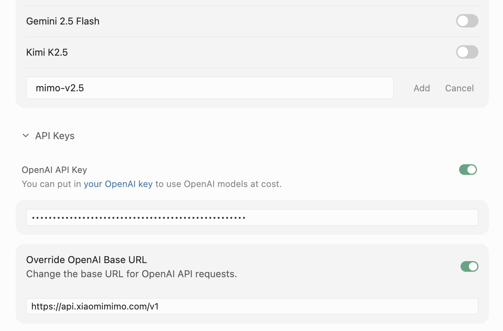

[English](./cursor.md) | [简体中文](./cursor.zh-CN.md) · [← 返回](../README.zh-CN.md)

# 接入 Cursor

[Cursor](https://www.cursor.com/) 是一款基于 VS Code 的 AI 原生代码编辑器，支持通过 OpenAI 协议接入自定义模型供应商，可将 MiMo 作为后端模型接入。

## 前置条件

Cursor 支持**按量付费 API** 和 **Token Plan** 两种使用方式，配置前需先获取对应凭证。

| 使用方式 | 说明 | 获取凭证 |
|---|---|---|
| **按量付费** | 按实际使用量计费，适合轻度使用 | 前往 [API Keys](https://platform.xiaomimimo.com/console/api-keys) 创建 API Key |
| **Token Plan** | 固定订阅，按套餐限量调用 | 订阅成功后，前往 [订阅管理](https://platform.xiaomimimo.com/console/plan-manage) 获取专属 Base URL 和 API Key |

## 1. 安装 Cursor

从 [cursor.com](https://www.cursor.com/) 下载并安装 Cursor。

## 2. 添加 MiMo 自定义模型

1. 打开 Cursor **Settings → Models**。
2. 下滑到模型列表，点击 **+ Add Custom Model**，输入 `mimo-v2.5-pro`。
3. 展开下方 **API Keys** 区域，开启 **OpenAI API Key** 并填入你的 MiMo API Key。
4. 开启 **Override OpenAI Base URL**，设置为：
   - 按量付费：`https://api.xiaomimimo.com/v1`
   - Token Plan：`https://token-plan-{region}.xiaomimimo.com/v1`

> **注意：** 模型名称必须全小写（`mimo-v2.5-pro`）。使用错误大小写如 `Mimo-v2.5-pro` 会导致 "Not supported model" 错误。

5. 点击 **Save**。

## 3. 选择 MiMo 并开始编程

返回 Cursor 主界面，切换到刚配置的 MiMo 供应商，即可开始编程。

可用模型：

| 模型 ID | 说明 |
|---|---|
| `mimo-v2.5-pro` | 文本生成，推理能力最强 |
| `mimo-v2.5` | 多模态（文本 + 图片输入） |

## 相关资源

- [Cursor](https://www.cursor.com/) — AI 原生代码编辑器。
- [MiMo 官网](https://mimo.xiaomi.com/)
- [MiMo 开放平台](https://platform.xiaomimimo.com/) — API Key 管理与用量查看。
