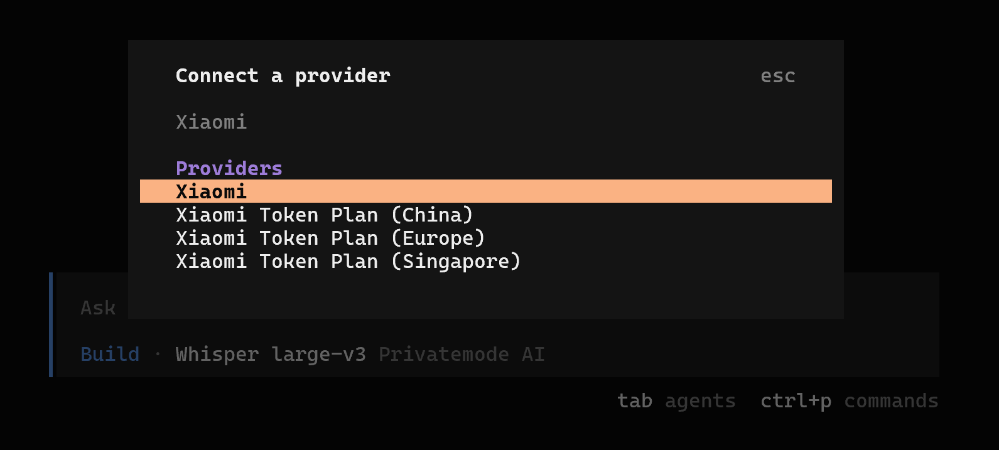

[English](./opencode.md) | [简体中文](./opencode.zh-CN.md) · [← Back](../README.md)

# Integrate with OpenCode

OpenCode is an open-source AI coding agent that runs in the terminal, as a desktop app, or as an IDE extension. MiMo recommends integrating with OpenCode via the OpenAI-compatible protocol.

## Prerequisites

Both **Pay-as-you-go API** and **Token Plan** are supported with OpenCode. You need to obtain the corresponding credentials before configuration.

| Usage Mode | Description | How to Get Credentials |
|---|---|---|
| **Pay-as-you-go** | Billed by actual usage, suitable for light use | Go to [API Keys](https://platform.xiaomimimo.com/console/api-keys) and create an API Key |
| **Token Plan** | Fixed subscription with quota-based access | After subscribing, go to [Subscription Management](https://platform.xiaomimimo.com/console/plan-manage) to get your dedicated Base URL and API Key |

## 1. Install OpenCode CLI

Requires [Node.js](https://nodejs.org/en/download/) 18+.

```shell
npm install -g opencode-ai
```

Verify the installation:

```shell
opencode -v
```

For more installation methods (install script, Homebrew, Chocolatey, Scoop, etc.), see the [official docs](https://opencode.ai/docs).

## 2. Configure OpenCode

### Quick Setup via `/connect` (Recommended)

Launch OpenCode and type `/connect`, search for `Xiaomi`, select the provider matching your credential type, and fill in your API Key.



> For **Token Plan** users, select the provider matching your cluster region:
> - `https://token-plan-cn.xiaomimimo.com/*` → Xiaomi Token Plan (China)
> - `https://token-plan-sgp.xiaomimimo.com/*` → Xiaomi Token Plan (Singapore)
> - `https://token-plan-ams.xiaomimimo.com/*` → Xiaomi Token Plan (Europe)

### Manual Configuration

Alternatively, edit or create the configuration file at:
- macOS / Linux: `~/.config/opencode/opencode.json`
- Windows: `C:\Users\<your username>\.config\opencode\opencode.json`

#### Supported Models

See the [Model List](https://platform.xiaomimimo.com/docs/en-US/quick-start/model) for all available models.

#### Pay-as-you-go

Go to [API Keys](https://platform.xiaomimimo.com/console/api-keys) and create an API Key (format: `sk-xxxxx`).

```json
{
  "$schema": "https://opencode.ai/config.json",
  "provider": {
    "mimo": {
      "npm": "@ai-sdk/openai-compatible",
      "name": "MiMo",
      "options": {
        "baseURL": "https://api.xiaomimimo.com/v1",
        "apiKey": "MIMO_API_KEY"
      },
      "models": {
        "mimo-v2.5-pro": {
          "name": "mimo-v2.5-pro",
          "limit": {
            "context": 1048576,
            "output": 131072
          }
        },
        "mimo-v2.5": {
          "name": "mimo-v2.5",
          "limit": {
            "context": 1048576,
            "output": 131072
          },
          "modalities": {
            "input": ["text", "image"],
            "output": ["text"]
          }
        }
      }
    }
  },
  "model": "mimo/mimo-v2.5-pro"
}
```

#### Token Plan

After subscribing, go to [Subscription Management](https://platform.xiaomimimo.com/console/plan-manage) to get your dedicated Base URL and API Key (format: `tp-xxxxx`).

> Replace `{region}` with the cluster shown in your [Subscription Management](https://platform.xiaomimimo.com/console/plan-manage) page (`cn` for China, `sgp` for Singapore, `ams` for Europe).

```json
{
  "$schema": "https://opencode.ai/config.json",
  "provider": {
    "mimo": {
      "npm": "@ai-sdk/openai-compatible",
      "name": "MiMo-TokenPlan",
      "options": {
        "baseURL": "https://token-plan-{region}.xiaomimimo.com/v1",
        "apiKey": "MIMO_API_KEY"
      },
      "models": {
        "mimo-v2.5-pro": {
          "name": "mimo-v2.5-pro",
          "limit": {
            "context": 1048576,
            "output": 131072
          }
        },
        "mimo-v2.5": {
          "name": "mimo-v2.5",
          "limit": {
            "context": 1048576,
            "output": 131072
          },
          "modalities": {
            "input": ["text", "image"],
            "output": ["text"]
          }
        }
      }
    }
  },
  "model": "mimo/mimo-v2.5-pro"
}
```

#### Enable Thinking Mode

MiMo models support extended thinking. Add the `thinking` option to your model configuration to enable it:

```json
"mimo-v2.5-pro": {
  "name": "mimo-v2.5-pro",
  "limit": {
    "context": 1048576,
    "output": 131072
  },
  "options": {
    "thinking": {
      "type": "enabled"
    }
  }
}
```

> Set `"type": "disabled"` to turn off thinking mode.

#### Notes

- Replace `MIMO_API_KEY` with your actual API key.
- The `"model": "mimo/mimo-v2.5-pro"` field sets the default model. Format: `provider-id/model-id`.
- After launching OpenCode, run `/models` to view and switch between available models.

## 3. Desktop App (Optional)

OpenCode Desktop is available in Beta for macOS, Windows, and Linux. Download from the [official download page](https://opencode.ai/download).

The desktop app shares the same configuration file (`~/.config/opencode/opencode.json`) as the CLI.

## 4. VS Code Extension (Optional)

Search for **OpenCode** in the [VS Code Extensions marketplace](https://marketplace.visualstudio.com/) and install it.

The extension shares the same configuration file (`~/.config/opencode/opencode.json`) as the CLI.

Alternatively, you can use the `/connect` command in the extension to configure MiMo directly:
1. Type `/connect` and search for `Xiaomi`
2. Select the corresponding provider and fill in your API Key

> For **Token Plan** users, select the provider matching your cluster region:
> - `https://token-plan-cn.xiaomimimo.com/*` → Xiaomi Token Plan (China)
> - `https://token-plan-sgp.xiaomimimo.com/*` → Xiaomi Token Plan (Singapore)
> - `https://token-plan-ams.xiaomimimo.com/*` → Xiaomi Token Plan (Europe)

## 5. Use OpenCode

### Using OpenCode CLI

Enter the project directory and run `opencode`:

```shell
cd /path/to/my-project
opencode
```

On first launch, run `/init` to generate an `AGENTS.md` file that helps OpenCode understand your project structure.

### Using OpenCode VS Code Extension

Open your project directory in VS Code, click the OpenCode icon, and start a conversation.

## Resources

- [OpenCode](https://opencode.ai/docs) — Open-source AI coding agent.
- [MiMo Official Website](https://mimo.xiaomi.com/)
- [MiMo Platform](https://platform.xiaomimimo.com/) — API key management and usage.
