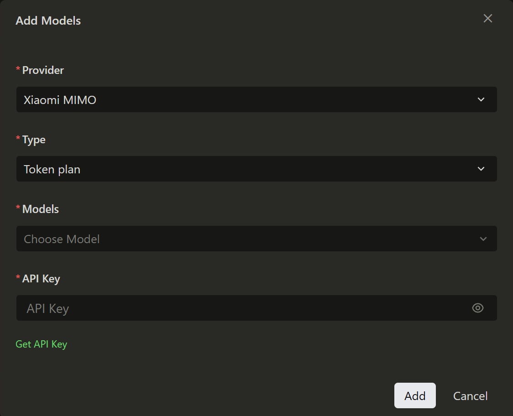

[English](./qoder.md) | [简体中文](./qoder.zh-CN.md) · [← Back](../README.md)

# Integrate with Qoder

[Qoder](https://qoder.com.cn/desktop), formerly Lingma, is an AI agent product series by Alibaba Cloud, covering software development and daily office scenarios. It includes Qoder CN (IDE, JetBrains plugin) for coding, QoderWork CN (desktop app) for daily work, Qoder CN CLI (terminal-native form), QoderWake CN (digital employee), Qoder Cloud Agents (cloud agent platform), and more. The series is based on mainstream domestic large models and deployed domestically to meet the high requirements of industries like finance and government for data security and compliance.

## Prerequisites

Qoder supports both **Pay-as-you-go API** and **Token Plan** usage modes. You need to obtain the corresponding credentials before configuration.

| Usage Mode | Description | How to Get Credentials |
|---|---|---|
| **Pay-as-you-go** | Billed by actual usage, suitable for light use | Go to [API Keys](https://platform.xiaomimimo.com/console/api-keys) and create an API Key |
| **Token Plan** | Fixed subscription with quota-based access | After subscribing, go to [Subscription Management](https://platform.xiaomimimo.com/console/plan-manage) to get your dedicated Base URL and API Key |

## 1. Install Qoder Desktop

Download and install Qoder Desktop from the [official website](https://qoder.com.cn/desktop).

For detailed installation instructions, see the [Qoder documentation](https://help.aliyun.com/zh/lingma/product-overview/introduction-of-lingma).

## 2. Add Custom Model

### 2.1. Supported Models

Qoder Desktop supports both chat and code completion models. The following example uses `mimo-v2.5-pro`. See the [Model List](https://platform.xiaomimimo.com/docs/zh-CN/quick-start/model) for all available models.

### 2.2. Configuration Steps

1. Open File -> Preferences -> **Qoder Settings**.

2. In the left menu bar, under **Models**, click **Add**.

3. Select **Xiaomi MIMO** as the provider.

4. Fill in the configuration (see [Pay-as-you-go](#pay-as-you-go) or [Token Plan](#token-plan) below).

5. Click **Model Selection**, which supports Mimo-2.5-Pro and Mimo-2.5 by default.

### Pay-as-you-go

When adding a model, select "Pay-as-you-go" as the type and enter the corresponding pay-as-you-go API_KEY.

Go to [API Keys](https://platform.xiaomimimo.com/console/api-keys) and create an API Key (format: `sk-xxxxx`).

### Token Plan

After subscribing, go to [Subscription Management](https://platform.xiaomimimo.com/console/plan-manage) to get your dedicated Base URL and API Key (format: `tp-xxxxx`).

When adding a model, select "Token Plan" as the type and enter the corresponding Token Plan API_KEY.

## 3. Use MiMo in Qoder Desktop

1. Open the AI sidebar.
2. In the conversation panel, select your added custom model from the model dropdown list and click confirm.
3. You are now ready to start using MiMo.

## Resources

- [Qoder Official Website](https://qoder.com.cn/) — download and product information.
- [Qoder Documentation](https://help.aliyun.com/zh/lingma/product-overview/introduction-of-lingma) — official guides and references.
- [MiMo Official Website](https://mimo.xiaomi.com/)
- [MiMo Platform](https://platform.xiaomimimo.com/) — API key management and usage.
