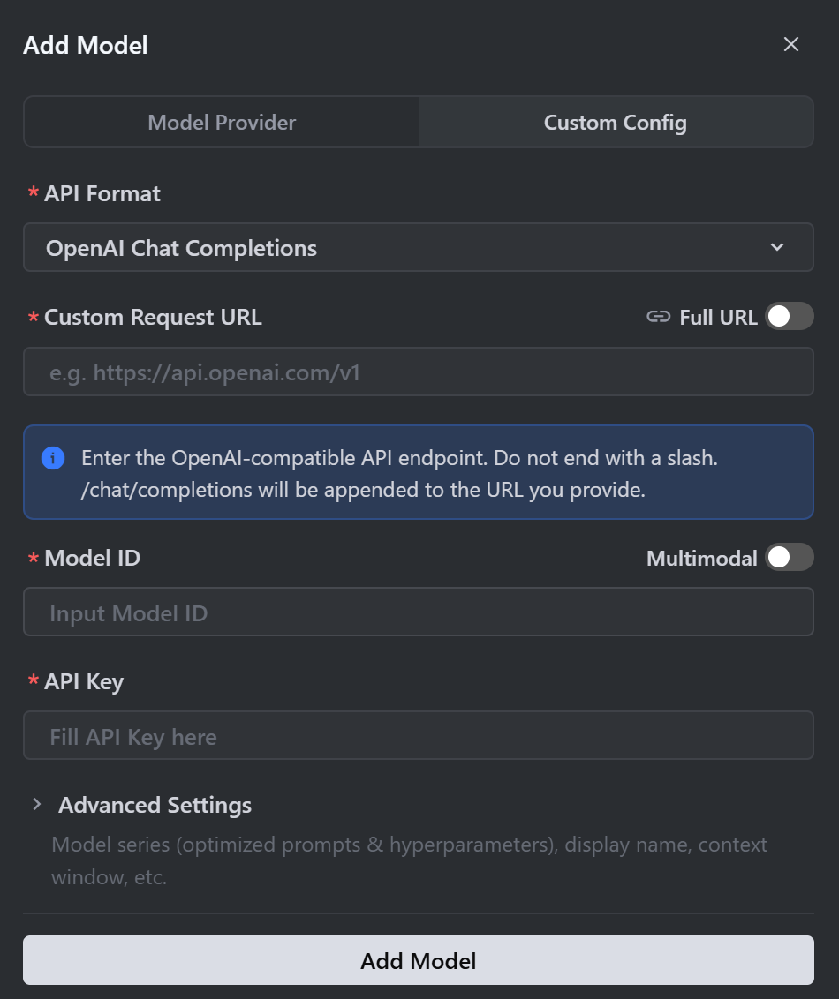

[English](./trae.md) | [简体中文](./trae.zh-CN.md) · [← 返回](../README.zh-CN.md)

# 接入 TRAE

[TRAE](https://www.trae.cn/)（The Real AI Engineer）是字节跳动推出的 AI 原生 IDE。MiMo 推荐通过 OpenAI 兼容协议接入 TRAE IDE。

## 前置条件

TRAE 支持**按量付费 API** 和 **Token Plan** 两种使用方式，配置前需先获取对应凭证。

| 使用方式 | 说明 | 获取凭证 |
|---|---|---|
| **按量付费** | 按实际使用量计费，适合轻度使用 | 前往 [API Keys](https://platform.xiaomimimo.com/console/api-keys) 创建 API Key |
| **Token Plan** | 固定订阅，按套餐限量调用 | 订阅成功后，前往 [订阅管理](https://platform.xiaomimimo.com/console/plan-manage) 获取专属 Base URL 和 API Key |

## 1. 安装 TRAE IDE

从[官网](https://www.trae.cn/)下载并安装 TRAE IDE。

详细安装说明请参阅 [TRAE 文档](https://docs.trae.cn/ide/get-started-with-trae)。

## 2. 添加自定义模型

### 支持的模型

TRAE 支持对话模型和代码补全模型。以下示例以 `mimo-v2.5-pro` 为例，完整模型列表请参阅 [模型列表](https://platform.xiaomimimo.com/docs/zh-CN/quick-start/model)。

### 配置步骤

1. 打开 TRAE 面板，点击右上角 **Settings**。

2. 在左侧菜单栏 **Models** 下，点击 **Add Custom model here**。

3. 选择 **Custom Config**，然后 **API Format** 选择 **OpenAI Chat Completions**。

4. 填写配置信息（参考后续[按量付费](#按量付费)或 [Token Plan](#token-plan) 章节）。

5. 点击 **Add Model** 保存模型。

### 按量付费

前往 [API Keys](https://platform.xiaomimimo.com/console/api-keys) 创建 API Key（格式：`sk-xxxxx`）。

| 字段 | 值 |
|-------|-------|
| Custom Request URL | `https://api.xiaomimimo.com/v1` |
| Model ID | `mimo-v2.5-pro` |
| API Key | 你的 API Key（`sk-xxxxx`） |

> 若开启了 Full URL 选项，Custom Request URL 需填写完整路径 `https://api.xiaomimimo.com/v1/chat/completions`。

> 若使用支持多模态的模型（如 `mimo-v2.5`），可勾选 Model ID 右侧的 **MultiModal** 选项。

### Token Plan

订阅成功后，前往 [订阅管理](https://platform.xiaomimimo.com/console/plan-manage) 获取专属 Base URL 和 API Key（格式：`tp-xxxxx`）。

> 将 `{region}` 替换为 [订阅管理](https://platform.xiaomimimo.com/console/plan-manage) 页面中显示的集群标识（`cn` 中国集群、`sgp` 新加坡集群、`ams` 欧洲集群）。

| 字段 | 值 |
|-------|-------|
| Custom Request URL | `https://token-plan-{region}.xiaomimimo.com/v1` |
| Model ID | `mimo-v2.5-pro` |
| API Key | 你的 API Key（`tp-xxxxx`） |

> 若开启了 Full URL 选项，Custom Request URL 需填写完整路径 `https://token-plan-{region}.xiaomimimo.com/v1/chat/completions`。

> 若使用支持多模态的模型（如 `mimo-v2.5`），可勾选 Model ID 右侧的 **MultiModal** 选项。

## 3. 在 TRAE 中使用 MiMo

1. 关闭 **Auto Mode**。
2. 在对话面板中，从模型下拉列表选择已添加的自定义模型。
3. 即可开始使用 MiMo。

## 相关资源

- [TRAE 官网](https://www.trae.cn/) — 下载与产品信息。
- [TRAE 文档](https://docs.trae.cn/) — 官方指南与参考文档。
- [MiMo 官网](https://mimo.xiaomi.com/)
- [MiMo 开放平台](https://platform.xiaomimimo.com/) — API Key 管理与用量查看。
