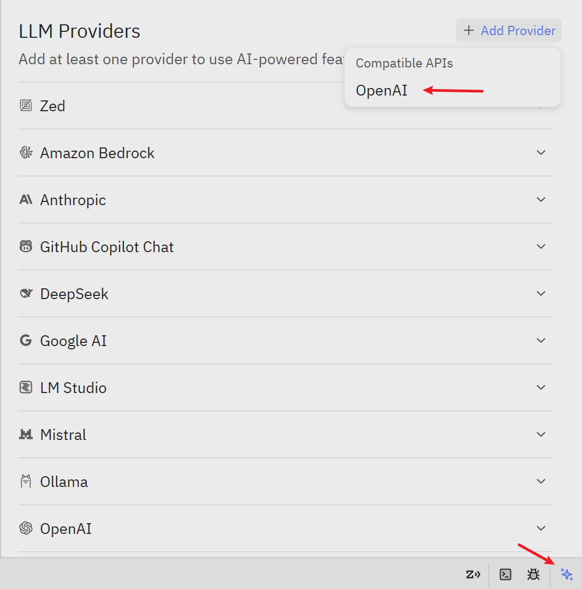
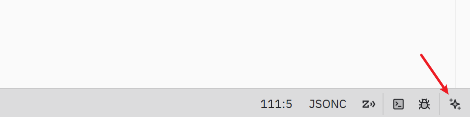

[English](./zed.md) | [简体中文](./zed.zh-CN.md) · [← Back](../README.md)

# Integrate with Zed

Zed is a high-performance code editor with built-in AI assistant capabilities. MiMo integrates with Zed via the OpenAI-compatible protocol.

## Prerequisites

Both **Pay-as-you-go API** and **Token Plan** are supported with Zed. You need to obtain the corresponding credentials before configuration.

| Usage Mode | Description | How to Get Credentials |
|---|---|---|
| **Pay-as-you-go** | Billed by actual usage, suitable for light use | Go to [API Keys](https://platform.xiaomimimo.com/console/api-keys) and create an API Key |
| **Token Plan** | Fixed subscription with quota-based access | After subscribing, go to [Subscription Management](https://platform.xiaomimimo.com/console/plan-manage) to get your dedicated Base URL and API Key |

## 1. Install Zed

Download and install Zed from the [official website](https://zed.dev/download).

## 2. Configure via Agent Panel (Recommended)

### Supported Models

Zed only supports text generation models. See the [Model List](https://platform.xiaomimimo.com/docs/en-US/quick-start/model) for all available models.

### 2.1 Open the Agent Panel and Add Provider

Click the **Select a model**, then click **Configure** to enter the LLM Providers page. Click **+ Add Provider** in the top-right corner and select **OpenAI** (Compatible APIs).



### 2.2 Fill in Configuration (using `mimo-v2.5-pro` as an example)

#### API URL & API Key

Choose the values based on your usage mode:

**Pay-as-you-go**

| Field | Value |
|---|---|
| **API URL** | `https://api.xiaomimimo.com/v1` |
| **API Key** | Your API Key (format: `sk-xxxxx`), created at [API Keys](https://platform.xiaomimimo.com/console/api-keys) |

**Token Plan**

| Field | Value |
|---|---|
| **API URL** | `https://token-plan-{region}.xiaomimimo.com/v1` |
| **API Key** | Your API Key (format: `tp-xxxxx`), obtained from [Subscription Management](https://platform.xiaomimimo.com/console/plan-manage) |

> Replace `{region}` with the cluster shown in your [Subscription Management](https://platform.xiaomimimo.com/console/plan-manage) page (`cn` for China, `sgp` for Singapore, `ams` for Europe).

#### Other Fields

| Field | Value |
|---|---|
| **Provider Name** | `MiMo` |
| **Model Name** | `mimo-v2.5-pro` |
| **Max Tokens** | `1048576` |
| **Max Completion Tokens** | `131072` |
| **Max Output Tokens** | `131072` |
| **Supports tools** | Check this option |
| **Supports images** | Check this option if the model supports multimodal input (e.g. `mimo-v2.5`) |

### 2.3 Save Configuration

Click **Save Provider** to save. The newly added provider will appear in the LLM Providers list.

### 2.4 Select Model and Start Using

Select `mimo-v2.5-pro` from the model selector at the bottom of the Agent panel, then click **Start New Thread** to begin.

## 3. Configure via settings.json (Optional)

You can also configure the provider directly in the settings file instead of using the Agent panel GUI. This is also useful for fine-grained settings such as default model.

Click **Settings**, then click **Edit in settings.json** to open the `settings.json` file.

> After saving the `settings.json` with the correct configuration, the custom provider will appear in the LLM Providers list in the Agent panel. You can then enter your API Key there.

### Configure LLM Provider

#### Pay-as-you-go

```json
{
  "language_models": {
    "openai_compatible": {
      "MiMo": {
        "api_url": "https://api.xiaomimimo.com/v1",
        "available_models": [
          {
            "name": "mimo-v2.5-pro",
            "max_tokens": 1048576,
            "max_output_tokens": 131072,
            "max_completion_tokens": 131072,
            "capabilities": {
              "tools": true,
              "images": false,
              "parallel_tool_calls": false,
              "prompt_cache_key": false,
              "chat_completions": true,
              "interleaved_reasoning": false
            }
          },
          {
            "name": "mimo-v2.5",
            "max_tokens": 1048576,
            "max_output_tokens": 131072,
            "max_completion_tokens": 131072,
            "capabilities": {
              "tools": true,
              "images": true,
              "parallel_tool_calls": false,
              "prompt_cache_key": false,
              "chat_completions": true,
              "interleaved_reasoning": false
            }
          }
        ]
      }
    }
  }
}
```

#### Token Plan

> Replace `{region}` with the cluster shown in your [Subscription Management](https://platform.xiaomimimo.com/console/plan-manage) page (`cn` for China, `sgp` for Singapore, `ams` for Europe).

```json
{
  "language_models": {
    "openai_compatible": {
      "MiMo-TokenPlan": {
        "api_url": "https://token-plan-{region}.xiaomimimo.com/v1",
        "available_models": [
          {
            "name": "mimo-v2.5-pro",
            "max_tokens": 1048576,
            "max_output_tokens": 131072,
            "max_completion_tokens": 131072,
            "capabilities": {
              "tools": true,
              "images": false,
              "parallel_tool_calls": false,
              "prompt_cache_key": false,
              "chat_completions": true,
              "interleaved_reasoning": false
            }
          },
          {
            "name": "mimo-v2.5",
            "max_tokens": 1048576,
            "max_output_tokens": 131072,
            "max_completion_tokens": 131072,
            "capabilities": {
              "tools": true,
              "images": true,
              "parallel_tool_calls": false,
              "prompt_cache_key": false,
              "chat_completions": true,
              "interleaved_reasoning": false
            }
          }
        ]
      }
    }
  }
}
```

## 4. Use Zed AI Features

### Agent Panel

Click the icon in the bottom-right corner of the status bar to open the Agent panel.



### Inline Assistant

Select code in the editor and press `Ctrl+Enter` to get inline AI assistance.

## Resources

- [Zed](https://zed.dev/) — A high-performance code editor.
- [Zed AI Documentation](https://zed.dev/docs/ai/llm-providers) — LLM provider configuration guide.
- [MiMo Official Website](https://mimo.xiaomi.com/)
- [MiMo Platform](https://platform.xiaomimimo.com/) — API key management and usage.
